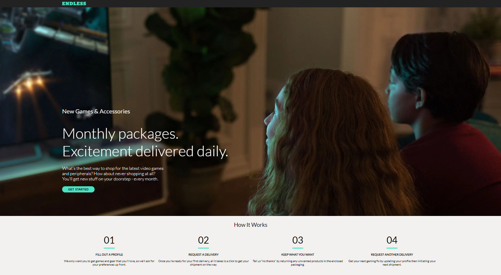

#### **Technical Exercise - Endless Comp**

---

## **Table of Contents**

1. [Description](#Description)
1. [Tech](#Tech)
1. [Installation](#Installation)
1. [Usage](#Usage)
1. [Test](#Test)
1. [Screenshots](#Screenshots)
1. [Contact](#Contact)

---

## **Description**

Greetings! Thank you for taking the time to look over my technical exercise submission. I am excited to review this and get your feedback, suggestions, and constructive criticism! I believe it is one of the best ways to learn and improve.

For this comp, after reviewing the React Docs, I decided to use Next.js as my starter toolchain. I could have used `create react app`, but since the content was relatively static, I felt that `Next.js` was a better fit and would be more performant.

I matched the appearance of the comp, as closely as possible. I also made considerations for responsiveness. You can take a look at the [Screenshots](#Screenshots) to see some of my results. The "hero" image was compressed really well. It was coming in at only 597kb. Next.js has some built-in image optimization as well. It will automatically lazy load images and render them in a way that helps avoid cumulative layout shift, amongst other optimizations and considerations.

The "GET STARTED" button has a color change transition for it's hover and active states.

The steps are sorted in numerical order. Then, the sorted array is passed to the `Steps` component, where I map over it, sort the nested `versionContent` arrays, and display the data associated with the most current `effectiveDate`.

I included a Jest `snapshot` test for the `Steps` component. The instructions for the test are located here: [Test](#Test).

Again, thank you so much for taking the time to look over my work. If you have any questions, do not hesitate to contact me! Take care!

---

## **Tech**

- React.js
- Next.js
- Jest
- Babel
- Node.js

---

## **Installation**

1. Clone the repo: `git clone https://github.com/Bertodemus/TE-Endless-Comp.git`
2. Install server-side NPM packages: `npm install`

---

## **Usage**

1. Run the app: `npm run dev`
1. In your browser, navigate to: `http://localhost:3000/`

---

## **Test**

1. Test the "step creation" component: `npm run test`

---

## **Screenshots**

Screenshot of the page

Screenshot of the page @500px wide

Screenshot of the page @400px wide

Screenshot of the page @320px wide

Screenshot of the page @1440px wide

---

## **Contact**

Below is my contact information. Do not hesitate to reach out to me if you have any questions.

|                | Email                    | Portfolio                                                   | Artwork                                       |
| -------------- | ------------------------ | ------------------------------------------------------------| --------------------------------------------- |
| Roberto Rubet  | roberto@robertorubet.com | [berto.netlify.app/about](https://berto.netlify.app/about)  | [BERTO!](https://www.robertorubet.com/)       |

---

### Thank you so much for taking the time to review my work!
